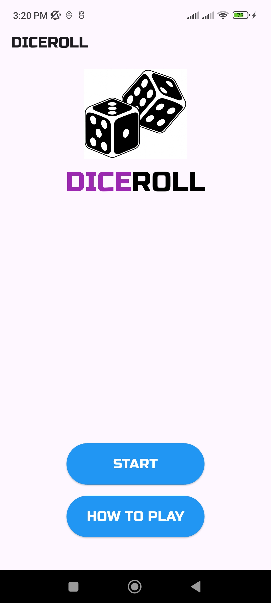
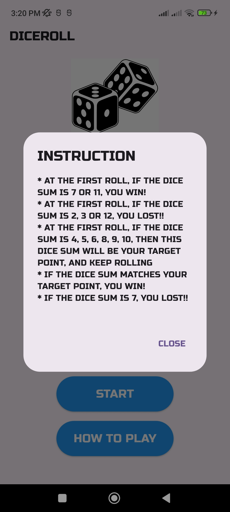
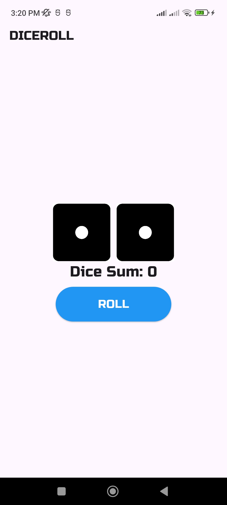
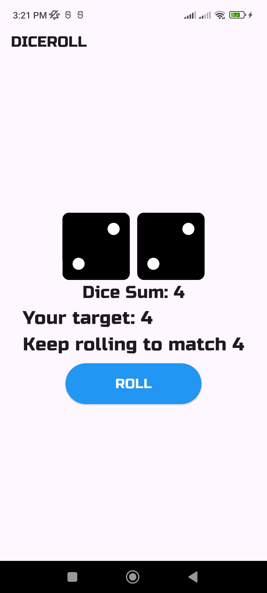
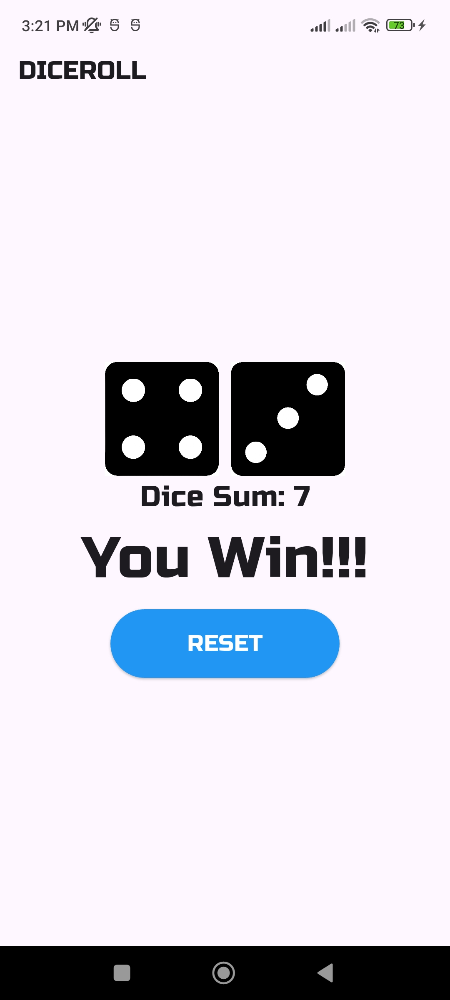
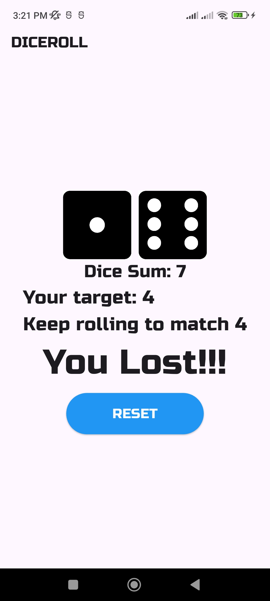
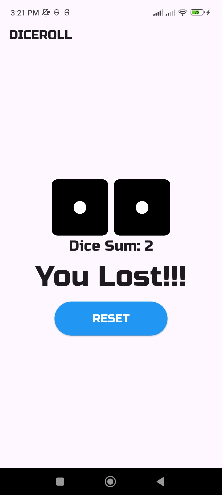

# 🎲 Dice Roll Game

A simple and fun cross-platform **Flutter** application that simulates the classic dice-rolling experience.  
This project demonstrates practical Flutter concepts like **stateful widgets**, **image rendering**, **random number generation**, and **game-state transitions** using enums — all structured with clean code and Git-based version control best practices.

<br>

## 📷 Screenshots

| Start Screen | Instruction Dialog |
|---------------|-------------------|
|  |  |

| Initial Roll (Sum = 0) | Target Set (Sum = 4) |
|------------------------|----------------------|
|  |  |

| Win State | Lose (Target Missed) | Lose (First Roll) |
|------------|----------------------|-------------------|
|  |  |  |

> All screenshots are stored inside the `assets/screenshots/` directory and linked directly for GitHub preview.

<br>

## 💻 Features

- Start screen with **game logo**, **title**, and interactive buttons (Start / Instructions)
- Dynamic dice rendering from local assets
- Core game logic based on **standard dice sum rules**
    - First roll determines **instant win/loss** or sets a **target point**
    - Subsequent rolls compare against target
- State transitions handled through `GameStatus` enum
- Clean and reusable custom widget: `DiceButton`
- Organized commits with clear, descriptive messages following `feat:` / `fix:` / `refactor:` prefixes

<br>

## 📁 Folder Structure

```
dice-roll-game/
├── lib/
│   ├── main.dart
│   ├── screens/
│   │   ├── start_page.dart
│   │   └── game_page.dart
│   ├── widgets/
│   │   └── dice_button.dart
│   ├── constants/
│   │   └── game_rules.dart
│   ├── models/
│   │   └── game_status.dart
│   └── utils/
│       └── dice_assets.dart
│
├── assets/
│   ├── images/
│   │   ├── d1.png
│   │   ├── d2.png
│   │   ├── d3.png
│   │   ├── d4.png
│   │   ├── d5.png
│   │   ├── d6.png
│   │   └── logo.png
│   │
│   └── screenshots/
│       ├── Screenshot_1.jpg
│       ├── Screenshot_2.jpg
│       ├── Screenshot_3.jpg
│       └── (additional screenshots)
│
├── pubspec.yaml
├── README.md
└── LICENSE
```

> - All image assets (dice faces, logo, etc.) are stored inside `assets/images/`.
> - App preview images for documentation are organized under `assets/screenshots/`.

<br>

## 🛠️ Dependencies

```yaml
dependencies:
  flutter:
    sdk: flutter
  google_fonts: ^6.3.2
```

> Uses **Google Fonts (RussoOne)** for consistent, bold typography and visual appeal.

<br>

## 🎯 Game Rules

```
AT THE FIRST ROLL:
  • If the dice sum is 7 or 11 → YOU WIN!
  • If the dice sum is 2, 3, or 12 → YOU LOST!!
  • If the dice sum is 4, 5, 6, 8, 9, or 10 → This becomes your TARGET.

IN SUBSEQUENT ROLLS:
  • Keep rolling until you MATCH your TARGET → YOU WIN!
  • If you roll a 7 before matching your TARGET → YOU LOSE!
```

<br>

## ⚙️ Getting Started

### 1️⃣ Clone Repository
```bash
git clone https://github.com/arrahman10/dice-roll-game.git
cd dice-roll-game
```

### 2️⃣ Install Dependencies
```bash
flutter pub get
```

### 3️⃣ Run Application
```bash
flutter run
```

> Make sure Flutter SDK and Dart are properly configured on your system.

<br>

## 🔧 Development Notes

- **Project Type:** Flutter mobile app (single-screen gameplay with conditional navigation)
- **Architecture:** Simple layered structure with clear separation of concerns:
    - `screens/` – UI screens like GamePage and StartPage
    - `widgets/` – Reusable UI components (e.g., DiceButton)
    - `constants/` – Game rules and text constants
    - `models/` – Enum model for managing game state (GameStatus)
    - `utils/` – Helper for loading image paths

- **Environment:**
    - Flutter SDK: ≥ 3.22
    - Dart SDK: ^3.9.2
    - App Version: 1.0.0+1
    - Publish Status: Private (`publish_to: none`)

- **Font Customization:**  
  Applied the `RussoOne` font globally using the `google_fonts` package to ensure visual consistency.

- **State Management:**  
  Basic `setState()` used to control UI updates and game logic. Controlled via:
    - `GameStatus` enum (none, running, over)
    - Flags like `hasTarget`, `shouldShowBoard`, and variables like `diceSum`, `result`, `target`

- **Random Logic:**  
  Used `Random.secure()` for stronger randomness when generating dice outcomes.

- **UI Conditions:**
    - Buttons (ROLL / RESET) are conditionally rendered based on game state.
    - StartPage and GamePage toggle via `shouldShowBoard`.

- **Image & Asset Handling:**  
  Dice face images (`d1.png` to `d6.png`) and `logo.png` are stored under `assets/images/`.  
  Instructional screenshots placed in `assets/screenshots/` for documentation.

- **Dialogs:**  
  Instruction popup created using `AlertDialog` with rich multiline content pulled from `game_rules.dart`.

- **Development Flow:**  
  Followed incremental commits with:
    - Proper semantic prefixes (`init:`, `feat:`, `style:`)
    - Clean commit history
    - Clear and structured descriptions for each change

- **Editor:**  
  Developed and tested using **Android Studio** with real device deployment for UI validation.

- **Testing Scope:**
    - Manual UI tests performed on Android device.
    - Functional testing includes win/lose scenarios and game state resets.

- **Limitations:**
    - No automated tests
    - No persistent storage or high-score tracking
    - UI optimized for mobile portrait view only

<br>

## 📝 License

This project is licensed under a **Personal and Educational Use Only License**.  
Commercial or business use is **strictly prohibited** without prior written consent.  
See the full [LICENSE](LICENSE) file for more details.

<br>

## 🙋‍♂️ Author

**Abdur Rahman**  
B.Sc. in Computer Science & Engineering, Leading University (Sylhet)  
GitHub: [@arrahman10](https://github.com/arrahman10)

---

> *This repository is maintained as part of my Flutter learning journey.  
> It follows professional project structuring, version control discipline, and documentation standards.*
